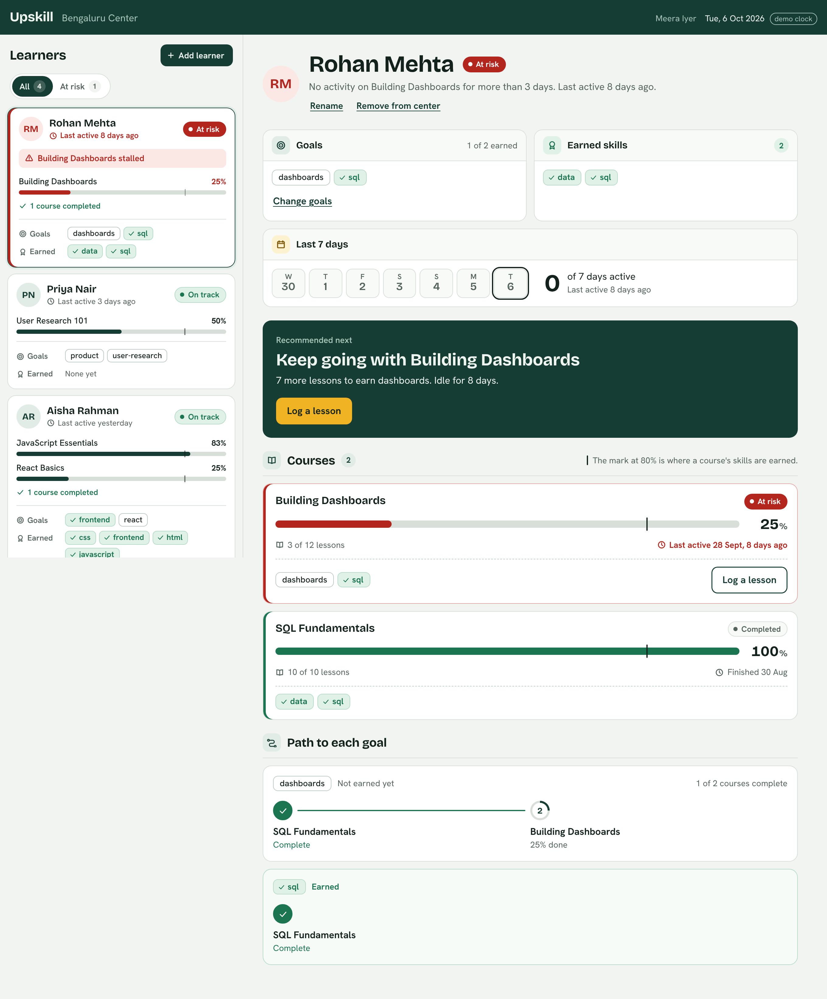
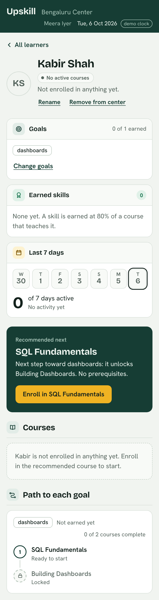
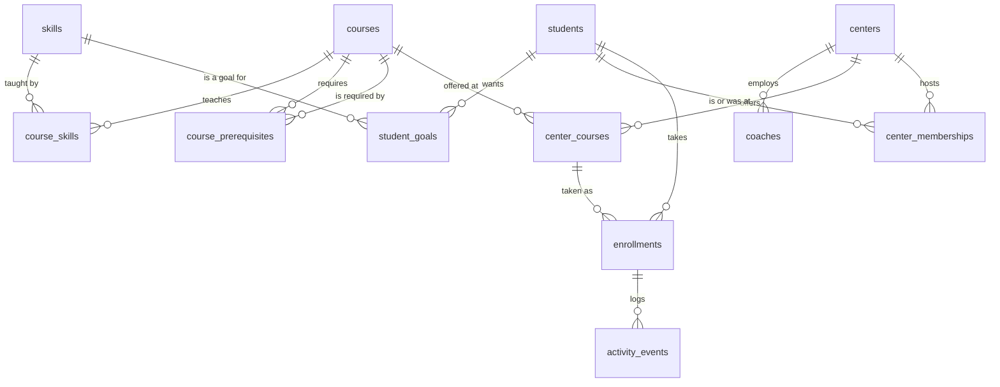

# Upskill

A coach's view of who is on track and who is at risk. Learners have goals, take courses with prerequisites, and earn skills. The roster puts the people who need attention at the top; one click shows why, and what each learner should do next.

React + TypeScript (Vite) · Node + Express + TypeScript · PostgreSQL.

| Desktop | Phone |
| --- | --- |
|  |  |

## Run it

Needs Node 20+ and PostgreSQL 14+.

```bash
docker compose up -d          # Postgres on 5432, with the dev and test databases
cp .env.example .env
npm install
npm run db:setup              # create the tables, import the seed
npm run dev                   # app on http://localhost:5173, API on :4000
```

No Docker: create a role and two databases, then carry on from `cp .env.example .env`.

```sql
CREATE ROLE upskill LOGIN PASSWORD 'upskill' CREATEDB;
CREATE DATABASE upskill OWNER upskill;
CREATE DATABASE upskill_test OWNER upskill;
```

| Command | What it does |
| --- | --- |
| `npm test` | 66 tests: the rules as pure functions, then the API against a real Postgres (`upskill_test`) |
| `npm run build && npm start` | One process on :4000 serving the API and the built React app |
| `npm run db:seed` | Wipe and re-import the seed |
| `npm run move-learner -- s1 pune` | Move a learner to another center |

**The demo clock.** The seed's dates are fixed and its last activity is 5 Oct 2026. `.env.example` pins "today" to 6 Oct with `AS_OF`, and the top bar says so. Remove `AS_OF` to use the real clock; every seeded learner will then be at risk, which is correct for data that old.

## What is built

| Requirement | Where |
| --- | --- |
| Student picker with goals, earned skills, active days | The roster. Each card shows goals, earned skills, status, the reason for it, and a progress track per course; picking a learner opens their "Last 7 days" panel with the active-day count. The roster is sorted as a triage list: at-risk learners first, longest-quiet on top, with an at-risk filter. |
| My courses, percent, on-track or at-risk | Courses section. Stalled courses sort to the top. |
| Recommend next: one course, short reason | The green card. Reasoning in [`recommendNext`](server/src/rules.ts). |
| Enroll, UI updates | The card's button. The server returns the updated learner; the roster re-sorts. |
| 3+ students, empty / loading / error, phone | 4 learners. Skeletons while loading, retry on failure, a plain sentence wherever a list is empty. Two panes from 900px, two screens below. |

### The rules, exactly

All of them are pure functions in [`server/src/rules.ts`](server/src/rules.ts), with the thresholds as named constants at the top.

- **Skill earned**: a course that teaches it is at least 80% complete. Compared as integers, and the percentage shown is rounded down, so the screen never shows 80% for a skill that is not earned.
- **Eligible**: every prerequisite is complete, meaning 100% of its lessons. The brief uses "80%" for skills and "complete" for prerequisites, so I kept them as two thresholds. A learner at 83% has the skill and still cannot enroll in the next course. If "complete" was meant as 80%, it is one constant: `PREREQUISITE_COMPLETE_AT_PERCENT`.
- **At risk**: an unfinished course with no activity for more than 3 calendar days in the center's time zone. Three days ago is on track, four is at risk. A course never started counts from its enrollment date. A finished course is never at risk. A learner is at risk if any of their courses is.
- **Active days**: distinct calendar days with a logged lesson, out of today and the six days before.

### Recommend next

1. Take the goals not yet earned. Collect every course that teaches one, plus everything those courses require. Nothing outside that set is ever recommended.
2. If one of them is offered here, not yet enrolled and eligible, recommend enrolling. Ties go to the course serving more goals, then the one closest to a goal, then the shortest.
3. Otherwise the learner is already enrolled in everything that helps. Name the course to finish first, which is the one blocking the others.
4. Otherwise say why there is nothing: no goals, every goal earned, or no course here leads to the goal.

Step 3 matters with this seed. All three provided learners are already enrolled in every course toward their goals, so recommending a new course would mean sending Aisha (goals: react, frontend) to SQL. The card tells her to finish JavaScript Essentials instead, because it is the prerequisite for the React course she has already started.

### Add-ons

Three, each chosen because the core screens are weaker without it.

1. **Onboard a learner from the dashboard.** "Add learner" takes a name and optional goals and puts the learner straight into the coach's center, ready to enroll. A coach can also rename a learner or remove them from the center. Removing ends their membership here and deletes nothing, because a learner is shared across centers.
2. **Goals you can change, and the path to each.** A learner's goals are editable, and each goal shows its chain of courses: done, in progress, ready, or locked. It explains the recommendation and shows how far the goal is.
3. **Log a lesson.** One button per course. Without it nothing can change after enrolling; with it you can watch a skill appear at 80%, the next course unlock at 100%, and an at-risk learner return to on track.

### Not built, on purpose

- **A course catalog.** There is no screen listing courses, and no way to create or edit one. A learner reaches a course through a goal.
- **Sign-in.** The API reads the coach from an `X-Coach-Id` header and falls back to `DEFAULT_COACH_ID`. It is one function (`withViewer` in `app.ts`); everything after it is already scoped to that coach's center.
- **Nudges, notes, notifications.** The obvious next step for an at-risk learner is "the coach reached out". It needs real coach identity first.
- **Charts and trends.** With one activity date per course in the seed, a chart would be decoration.
- **Course and lesson authoring.** A course has a lesson count, not lesson rows. Nothing here needs more.
- **A center switcher.** The schema and API are multi-center; the UI shows one.
- **A deploy.** `npm run build && npm start` is a single process that any Node host with a Postgres can run. I have not deployed it.

## Schema

Postgres, normalized. The JSON files are read once by [`server/src/seed.ts`](server/src/seed.ts) and never again. Full DDL: [`server/db/migrations/001_init.sql`](server/db/migrations/001_init.sql).



### Tables and keys

| Table | Primary key | Foreign keys | Other constraints |
| --- | --- | --- | --- |
| `skills` | `id` (slug) | | |
| `courses` | `id` | | `total_lessons > 0` |
| `course_skills` | `(course_id, skill_id)` | → `courses`, → `skills` | |
| `course_prerequisites` | `(course_id, prerequisite_id)` | both → `courses` | `course_id <> prerequisite_id` |
| `students` | `id` | | |
| `student_goals` | `(student_id, skill_id)` | → `students`, → `skills` | |
| `centers` | `id` | | has a `timezone` |
| `coaches` | `id` | `center_id` → `centers`, not null | |
| `center_courses` | `(center_id, course_id)` | → `centers`, → `courses` | |
| `center_memberships` | `id` | → `students`, → `centers` | unique `(student_id)` where `left_at is null`; `left_at >= joined_at` |
| `enrollments` | `id` | → `students`; `(center_id, course_id)` → `center_courses` | unique `(student_id, course_id)`; `completed_lessons >= 0`; trigger: `completed_lessons <= courses.total_lessons` |
| `activity_events` | `id` | `enrollment_id` → `enrollments` | index `(enrollment_id, occurred_at desc)` |

### Relationships

- Course to skill is many-to-many (`course_skills`). "frontend" is taught by three courses.
- Course to prerequisite is many-to-many on the same table (`course_prerequisites`).
- A goal is a learner pointing at a skill (`student_goals`), not free text. That is what lets goals and courses be matched.
- An enrollment is one learner in one course, once, ever. Progress is `completed_lessons` on that row.
- An activity event is one moment a learner worked on an enrollment.

### Derived, never stored

| Value | Read from |
| --- | --- |
| Percent complete | `enrollments.completed_lessons` / `courses.total_lessons` |
| Earned skills | enrollments at 80% or more, joined through `course_skills` |
| Last active | latest `activity_events.occurred_at` for the enrollment |
| Active days in 7 | distinct local dates of `activity_events` |
| On track / at risk | last active, or `enrolled_at` if never active |
| Eligibility, recommendation | prerequisites, goals and enrollments together |

Storing any of these would make two copies of one fact. Two things from the seed moved for the same reason: `totalLessons` repeats on every progress row but is a fact about the course, so it lives on `courses`; and `lastActiveAt` became one activity event rather than a column, so "last active" and "active days" read from the same rows.

Not enforced by the database: prerequisite cycles (a `CHECK` only stops a course requiring itself; the rules terminate on a cycle regardless) and prerequisite completion at enrollment (checked by the API inside the enrolling transaction).

## Multi-center

There is one center today (`blr`). The schema already assumes several.

| Shared by every center | Belongs to a center |
| --- | --- |
| `skills`, `courses`, `course_skills`, `course_prerequisites`: one catalog, so "react" and "React Basics" mean the same thing everywhere | `coaches`: each has exactly one `center_id` |
| `students`: a person is one row for life | `center_courses`: which of the shared courses this center offers |
| `student_goals`: goals are the learner's | `center_memberships`: which learners are here now, and who was here before |
| | `enrollments.center_id`: where the course was taken, for per-center reporting |

**A coach sees only their center.** There is no path to a learner except through one join: `center_memberships` where `left_at is null` and `center_id` is the coach's. Every read and write goes through it (`loadStudentFacts` and `lockStudent` in [`service.ts`](server/src/service.ts)). A learner at another center returns 404, the same as one who does not exist. The API tests add a second center and check this on every endpoint.

**A learner can move.** Moving closes the open membership row and opens a new one, in a transaction. Nothing else is touched. Goals, enrollments, progress and earned skills hang off the learner, so the new coach sees all of it and the old coach no longer sees the learner. The membership rows keep the history. A partial unique index means a learner cannot be in two centers at once. After the move, the learner is recommended only courses the new center offers, and new enrollments are stamped with the new center.

```bash
npm run move-learner -- s1 pune
```

**Adding and removing follow the same rule.** A learner added from the dashboard gets an open membership at the coach's own center, in the same transaction that creates them. "Remove from center" closes that membership and touches nothing else, so a coach cannot delete a person or their history, only end their time at this center.

It is a command, not an endpoint, because moving people is an org-admin action and there is no admin role to guard an endpoint with yet.

**When the second center opens**, add: real sign-in in place of the header stub; a `coach_centers` table if a coach should cover more than one center; and Postgres row-level security on the per-center tables as a second lock behind the query scoping.

## API

Every route is scoped to the calling coach's center.

| Method and path | Purpose |
| --- | --- |
| `GET /api/session` | Coach, center, today's date, skills that can be goals |
| `GET /api/students` | The roster, at-risk first |
| `POST /api/students` `{ name, skillIds? }` | Add a learner to the coach's center, with optional goals |
| `GET /api/students/:id` | One learner: courses, recommendation, goal paths |
| `PATCH /api/students/:id` `{ name }` | Rename a learner |
| `DELETE /api/students/:id` | Remove a learner from the coach's center. Their records are kept |
| `POST /api/students/:id/enrollments` `{ courseId }` | Enroll. 409 if already enrolled, 422 naming the unfinished prerequisite |
| `POST /api/students/:id/enrollments/:courseId/lessons` | Log one lesson. 409 when the course is complete |
| `PUT /api/students/:id/goals` `{ skillIds }` | Replace the learner's goals |

Errors come back as `{ "error": { "code", "message" } }`, and the message is written to be shown.

## Seed notes

- The four provided files are in [`server/seed/`](server/seed) unchanged. No courses were added.
- [`additions.json`](server/seed/additions.json) adds what they lack: the center, a coach, and a fourth learner, Kabir Shah, with a goal and no enrollments. He is there because the three provided learners are already enrolled in every course toward their goals, so none of them can show a first enrollment or an empty course list.
- Aisha is enrolled in React Basics while its prerequisite, JavaScript Essentials, is at 83%. The seed is kept as given: the import does not drop her enrollment, the course row carries a note ("Started before JavaScript Essentials was finished"), and the API refuses any new enrollment like it.
- The seed gives one last-active time per course, so each learner has at most one activity event per course. No history was invented to fill the 7-day strip.

## Layout

```
server/
  db/migrations/001_init.sql   the schema
  seed/                        provided JSON + additions.json
  src/rules.ts                 every product rule, pure
  src/service.ts               SQL and center scoping
  src/app.ts                   routes, auth stub, error shape
  src/seed.ts, migrate.ts      import and migrations
  test/                        rules.test.ts, api.test.ts
client/
  src/App.tsx                  shell, roster loading, hash routing
  src/Roster.tsx               the triage list
  src/StudentDetail.tsx        learner, courses, recommendation, goal path
  src/styles.css               one stylesheet, phone first
```

## A 3-minute demo

1. Roster: Rohan is at the top, at risk, with the reason. Filter to "At risk".
2. Open Aisha: 83% in JavaScript Essentials, skills earned, React Basics flagged. The card says to finish JavaScript first.
3. Add a learner with the goal `dashboards` (or open Kabir): no courses. The card recommends SQL Fundamentals as the step toward dashboards. Enroll.
4. Log 8 lessons: `sql` is earned at the 80% mark, Building Dashboards is still locked. Log 2 more: it unlocks and becomes the recommendation.
5. Change Priya's goals to `sql`: the recommendation follows the goal.
6. `npm run move-learner`, then the README's multi-center table.
